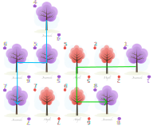

# COMP1110 Assignment 2

## Academic Honesty and Integrity

Honesty and integrity are of utmost importance. These goals are *not* at odds
with being resourceful and working collaboratively. You *should* be
resourceful, you should collaborate within your team, and you should discuss
the assignment and other aspects of the course with others taking the class.
However, *you must never misrepresent the work of others as your own*. If you
have taken ideas from elsewhere or used code sourced from elsewhere, you must
say so with *utmost clarity*. At each stage of the assignment you will be asked
to submit a statement of originality, either as a group or as individuals. This
statement is the place for you to declare which ideas or code contained in your
submission were sourced from elsewhere.

Please read the ANU's [official position](http://academichonesty.anu.edu.au/)
on academic honesty. If you have any questions, please ask me.

Carefully review the statements of originality in the [admin](admin) folder
which you must complete at each stage.  Edit the relevant statement and update
it as you complete each stage of the assignment, ensuring that when you
complete each stage, a truthful statement is committed and pushed to your repo.

## Purpose

In this assignment you will *work as a group* to master a number of major
themes of this course, including software design and implementation, group
work, using development tools such as Git and IntelliJ, and using JavaFX to
build a user interface.  **Above all, this assignment will emphasize group
work**; while you will receive an individual mark for your work based on your
contributions to the assignment, **you can only succeed if all members
contribute to your group's success**.

## Assignment Deliverables

The assignment is worth 30% of your total assessment, and it will be marked out of 30.
So each mark in the assignment corresponds to a mark in your final assessment for the course.
Note that for some stages of the assignment, you will get a _group_ mark, and for others you will be _individually_ marked.
The mark breakdown and the due dates are described on the [deliverables](https://cs.anu.edu.au/courses/comp1110/assessments/deliverables/) page.

Your tutor will mark your work via GitLab, so it is essential that you carefully follow instructions for setting up and maintaining your group repository.
You will be marked according to whatever is committed to your repository at the time of the deadline.
You will be assessed on how effectively you use Git as a development tool.

## Problem Description
Your task is to implement in Java, using JavaFX, a board game called [Arboretum](https://renegadegamestudios.com/arboretum/),
designed by [Dan Cassar](http://www.dancassar.com/) and published by [Renegade Game Studios](https://renegadegamestudios.com/).
Board Game Geek provides a [description of Arboretum](https://boardgamegeek.com/boardgame/140934/arboretum), and you can watch
a [how to play](https://www.youtube.com/watch?v=Ufh606Ettvo) and an [overview and review](https://www.youtube.com/watch?v=mmiXSOG1BtQ).

## Game Overview

Arboretum is a two- to four-player game in which players attempt to create carefully planned paths between trees. Players take turns *Drawing* cards from the *Deck* and *Discard* piles, placing one card in their *Arboretum* and discarding another card. The game ends when there are no cards left in the deck.

Use the above resources in addition to the rules description below. In case of any ambiguities, please consult Piazza for a clarification.

**Note** there are some modifications in our version, so you must read this page in its entirety. If you have any confusions please search the class Piazza forum and post a new question if you can't find your answer. 

### Components

The cards in the game have 10 different "suits" which correspond to 10 species of trees each with a unique colour. Within each species there are 8 cards numbered 1 to 8. This assignment will focus on a 2 player version of the game in which *only 6 of the 10 species are used*, making up a total deck size of 48.

### Game Setup

Each player has their own arboretum, discard pile and hand. Before the game starts, the following should be completed before the first player takes their turn.

1. The Deck is filled with 48 cards made up of 6 species of trees, and is shuffled (8 species are used for the three-player game and all 10 species for the four-player games).
2. Each player randomly draws 7 cards from the deck.
3. Player A takes the first turn.

We will be playing a two-player game, but you may extend your game to accommodate up to four players. 

## Player Turn

The game is played over multiple turns alternating between players, where each turn is composed of a sequence of three actions:
1. **Draw** 2 cards.
2. **Play** 1 card to arboretum.
3. **Discard** 1 card.

In more detail:

### Draw

On each turn a player draws 2 cards. They may draw randomly from the deck, or they may draw the top card from any player's discard pile (including their own!). You may look at the first card you draw before deciding where to draw the second card from.

* It is possible to draw both cards from the same location or from separate
  locations. This makes it possible to draw two cards deep into the discard
  pile of any player on a single turn.
* The cards in the deck remain hidden, so the players do not know precisely
  what cards remain in the deck.

### Play

After drawing the player then plays face up a card from their hand to their *arboretum*. Their arboretum is a grid where only a single card can occupy each space on the grid.

* If it is the player's first turn they can play a card anywhere in their
  arboretum.
* For each subsequent turn cards must be played adjacent (horizontally or
  vertically) to one or more cards already in their arboretum.

There is no explicit limit on the size of a player's arboretum in any direction. However, in practice it will be bounded by the number of cards that can be played, as determined by the finite deck size and end game condition.

### Discard

The player discards a card from their hand face up to *their* discard pile. This can be any card from your hand, including a card you drew this turn. After discarding, you should have exactly 7 cards in your hand.

## End of Game Scoring

The game ends when there are no more cards in the deck. The player who drew the last card finishes their turn normally, and then scoring occurs. The player with the highest score wins. 

### Gaining the Right to Score
For each tree species, each player reveals the cards of that species in their hand, and sums their values (each card 1 to 8). The player with the highest sum for that species gains the right to score their single highest scoring path for that species in their arboretum. If there is a tie, all tied players gain the right to *score* their highest scoring path of that species.

**Exception!** If you have the "8" of a species in hand, but an opponent has the "1" of that species in hand, the value "8" is considered to be "0" instead when determining who has the highest sum. (the "1" is always considered to be "1").

**Note 1:** It's possible to gain the right to score points for a species that is not present in your arboretum. In this case, you will not gain any points for that species.

**Note 2:** If no player has cards of a particular species in hand, all players gain the right to score points for their highest scoring path of that species.

### Scoring Paths
A path is a sequence of orthogonally adjacent cards of *ascending* value, where the *first* and *last* cards in the path are of the same species. Each card in the path must have a value greater than the card before it, but the values do not have to be consecutive. The only cards that must match the species you have gained the right to score are the first and last card. The cards in between can be of any species.

To score a path use the following criteria: 
1. Score 1 point for each card in the path.
2. Score 1 additional point for each card in the path if the path is at least 4 cards long *and* all cards in the path are the same species. 
3. Score 1 additional point if the path begins with "1".
4. Score 2 additional points if the path ends with "8".

**Note 1:** A card may be used in different paths for different species.

**Note 2:** You may only score one path for each species, so choose your highest scoring path for that species!

Credit to [Josh (Zhashiya)](https://boardgamegeek.com/user/zhashiya) on board game geek who posted these [fan-made cards](https://boardgamegeek.com/filepage/146943/arboretum-fan-made-cards) they made. Note: Some of the species names differ to our version.

In the above example, the blue path is `j4j5j6j7` and the green path is `j1m2m5m6mj8`.

The green path `j1m2m5m6mj8` is worth 8 points in total. 
- 5 points for the length.
- 1 extra point because it starts with a '1'.
- 2 extra points because it ends with an '8'.

The blue path `j4j5j6j7` is also worth 8 points in total.
- 4 points for the length.
- an extra 4 points for the length because the path is at least 4 cards long, and every card in the path is of the same species.

### Winner
The winner is the player who has scored the most points. In the case of a tie, the player with the most different species present in their arboretum wins. 

If there is still a tie, the tied players should plant a tree and the player whose tree has grown the tallest in five years' time is the winner! (We will consider the game to be a tie in this scenario!) 

## Encoding Game State

*More details of the `Arboretum` class and the string encoding used for interfacing our tests will be included here in a future version after D2B is complete.*
